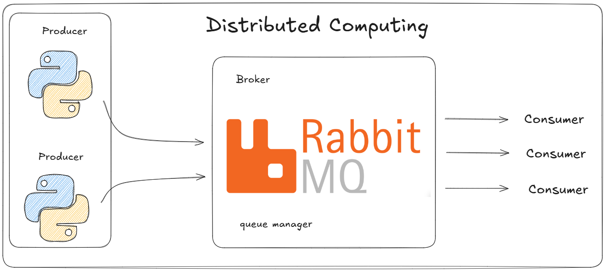

# Setup Celery & RabbitMQ

Este projeto é um exemplo simples de como configurar o **Celery** com o **RabbitMQ** como broker.

Computação distribuída é um modelo de computação no qual múltiplos computadores (ou nós) trabalham juntos para alcançar um objetivo comum, compartilhando tarefas e recursos através de uma rede.

## Qual motivo de usar essa stack?
Celery é uma lib para execução de tarefas assíncronas e agendadas em Python, que permite distribuir cargas de trabalho em múltiplos workers para aumentar a escalabilidade e a performance de aplicações.

Além disso, Celery é compatível com vários brokers de mensagens, não só RabbitMQ, mas também Redis, Amazon SQS, Apache Kafka, entre outros. Isso oferece flexibilidade para escolher o broker que melhor se adapta às necessidades do seu projeto.

## Por que delegar tarefas é importante? 
Em projetos modernos e sistemas complexos, tentar fazer tudo em uma única máquina pode ser ineficiente e limitar o crescimento do seu sistema. Delegar tarefas — ou seja, distribuir partes do trabalho para vários computadores — é essencial para conseguir escalar, acelerar processos e garantir maior disponibilidade.

Quando você delegar tarefas para outros nós na rede, você:

Libera recursos locais: A máquina principal não fica sobrecarregada executando tudo sozinha.

Aproveita o poder da colaboração: Máquinas diferentes podem trabalhar em paralelo, reduzindo o tempo total de execução.

Aumenta a escalabilidade: É possível expandir seu sistema adicionando novos nós facilmente.

Melhora a resiliência: Se um nó falhar, os outros continuam trabalhando, evitando paradas totais.

## Arquitetura


## Requisitos

- [Poetry](https://python-poetry.org/docs/)
- [Docker](https://www.youtube.com/watch?v=pRFzDVn40rw&list=PLbPvnlmz6e_L_3Zw_fGtMcMY0eAOZnN-H)
- Python 3.8+

## Instalação

Instale as dependências usando o Poetry:

```bash
poetry install
```

## Subindo o RabbitMQ com Docker

Crie um arquivo `docker-compose.yml` com o seguinte conteúdo:


Suba o container:

```bash
docker-compose up -d
```

Acesse o painel do RabbitMQ em: [http://localhost:15672](http://localhost:15672) (usuário: `guest`, senha: `guest`).

## Executando o Celery Worker

```bash
poetry run celery -A tasks worker --loglevel=info
```

## Usando Flower (Monitoramento)

Execute o Flower:

```bash
poetry run celery -A tasks flower
```

Acesse o Flower em: [http://localhost:5555](http://localhost:5555)

## Exemplo de Execução

O arquivo `main.py` envia uma tarefa para o Celery:

```
src/python main.py
```

## 📚 Referências

https://www.youtube.com/watch?v=G7PTQMtVVQk&t

https://pickle-reading-bd9.notion.site/py_live-010-2fb72b3202ff4810899cd29c05ea8a46

https://www.youtube.com/watch?v=ig9hbt-yKkM&t

## 🧑🏼‍🚀 Developer
| Desenvolvedor      | LinkedIn                                   | Email                        | Portfólio                              |
|--------------------|--------------------------------------------|------------------------------|----------------------------------------|
| Wallace Camargo    | [LinkedIn](https://www.linkedin.com/in/wallace-camargo-35b615171/) | wallacecpdg@gmail.com        | [Portfólio](https://wlcamargo.github.io/)   |
